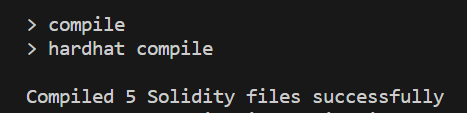
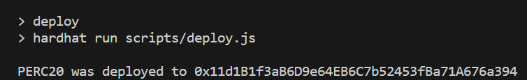
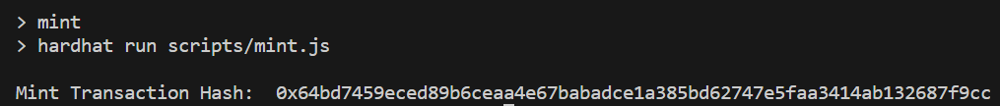
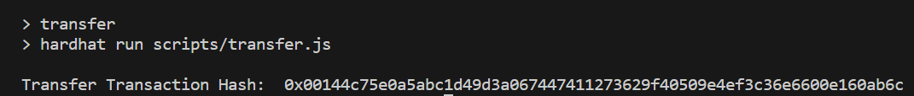

# Swisstronik Code Challenge 4 

In this project, there are sample contracts, tests, and scripts that deploy contracts, as well as the Swisstronik blockchain network. This case demonstrates the basic usage of Hardhat.

## Task

1. Deploy an PERC20 token
2. Mint PERC20 tokens
3. Transfer at least 1 of your PERC20 tokens to 0x16af037878a6cAce2Ea29d39A3757aC2F6F7aac1

## Token Details

```
Name    : GIGUAN
Symbol  : GGWP
```

## Smart Contract

```
0x11d1B1f3aB6D9e64EB6C7b52453fBa71A676a394
```

## Transfer Hash to 0x16af037878a6cAce2Ea29d39A3757aC2F6F7aac1

```
0x00144c75e0a5abc1d49d3a067447411273629f40509e4ef3c36e6600e160ab6c
```

### Network: Swisstronik

#### Copy `example.env to .env` and import your PK

```shell
cp example.env .env 
```

#### `Function Compile`

```shell
npm run compile
```


#### `Function Deploy`

```shell
npm run deploy
```


#### `Function Mint`

```shell
npm run mint
```


#### `Function Transfer`

```shell
npm run transfer
```


## Conclusion

Tx hash Deploy
```
https://explorer-evm.testnet.swisstronik.com/tx/0xca47a1afd89dd4df6021dc6b4a873a79056b7c8a148a974a176ad2507ef32919
```

Tx hash Mint
```
https://explorer-evm.testnet.swisstronik.com/tx/0x64bd7459eced89b6ceaa4e67babadce1a385bd62747e5faa3414ab132687f9cc
```

Tx hash Transfer
```
https://explorer-evm.testnet.swisstronik.com/tx/0x00144c75e0a5abc1d49d3a067447411273629f40509e4ef3c36e6600e160ab6c
```

